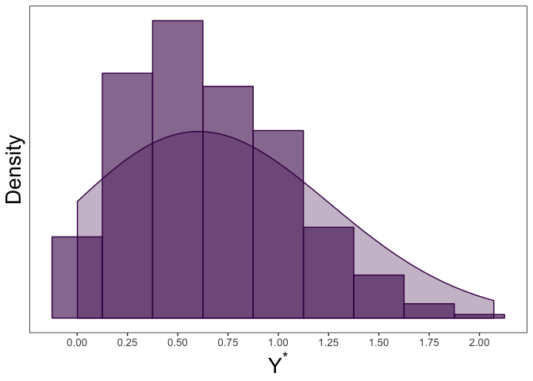
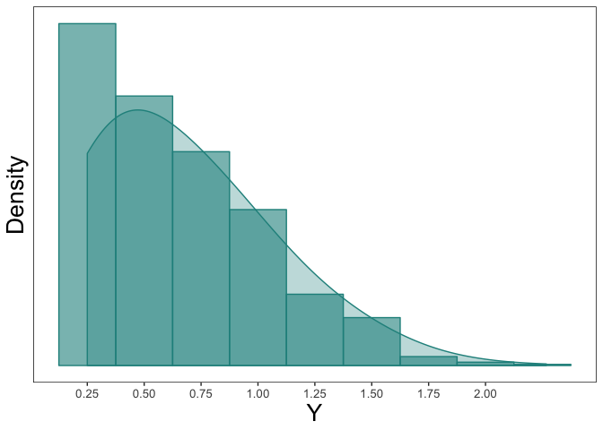

tcensReg: Maximum Likelihood Estimation of a Truncated Normal Distribution with Censored Data
================

The goal of this package is to estimate parameters from a linear model when the data comes from a truncated normal distribution with censoring. Maximum likelihood values are returned derived from Newton-Raphson algorithm using analytic values of the gradient and hessian. This package is also able to return maximum likelihood estimates for truncated only or censored only data similar to `truncreg` and `censReg` packages.

Installation
============

You can install ggplot.spaghetti from github via the devtools package with:

``` r
install.packages("devtools")
devtools::install_github("williazo/tcensReg")
```

Example 1: Single Population
============================

Some common examples where this type of problem may arise is when there is a natural truncation imposed by the structure of the data. For instance several applications have an implied zero truncation such as product lifetimes, age, or detection thresholds. To show how to implement the functions within the package, I will demonstrate a simple simulation example.

Assume that we have observations from an underlying truncated normal distribution

*Y*<sup>\*</sup> ∼ TN(*μ*, *σ*<sup>2</sup>, *a*),

where *a* denotes the value of the left-truncation. In our case we will assume a zero-truncated model by setting *a* = 0.

``` r
library(msm) #we will use this package to generate random values from the truncated normal distribution
mu <- 0.5
sigma <- 0.5
a <- 0

y_star <- msm::rtnorm(n = 1000, mean = mu, sd = sigma, lower = a)
range(y_star) #note that the lowerbound will always be non-negative
```

    ## [1] 0.001101319 2.071706840

Next, we can imagine a scenario where we have an imprecise measurement of *Y*<sup>\*</sup> leading to censoring. In our case we assume that values below *ν* are censored such that *a* &lt; *ν*. This creates the random variable *Y*, where

*Y*<sub>*i*</sub> = *ν*(1<sub>{*Y*<sub>*i*</sub><sup>\*</sup> ≤ *ν*}</sub>) + *Y*<sub>*i*</sub><sup>\*</sup>(1 − 1<sub>{*Y*<sub>*i*</sub><sup>\*</sup> ≤ *ν*}</sub>) and 1<sub>{*Y*<sub>*i*</sub><sup>\*</sup> ≤ *ν*}</sub> = 1 is *Y*<sub>*i*</sub><sup>\*</sup> ≤ *ν* and 0 otherwise.

In the example below we set *ν* = 0.25.

``` r
nu <- 0.25
y <- ifelse(y_star<=nu, nu, y_star)
sum(y==nu)/length(y) #calculating the number of censored observations
```

    ## [1] 0.162

``` r
dt <- data.frame(y_star, y) #collecting the uncensored and censored data together
```

We can observe the histogram and density plot for the uncensored data, which shows the zero-truncation. 

We can then compare this to the censored observations below 

We can then estimate *μ* and *σ* using our observed *Y* values with the `tcensReg` package as shown below.

``` r
library(tcensReg)  #loading the package into the current environment
tcensReg(y ~ 1, data = dt, a = 0, v = 0.25)
```

    ## $theta
    ##               Estimate
    ## (Intercept)  0.5293758
    ## log_sigma   -0.7188691
    ## 
    ## $iterations
    ## [1] 5
    ## 
    ## $initial_ll
    ## [1] -650.1115
    ## 
    ## $final_ll
    ## [1] -637.1345
    ## 
    ## $var_cov
    ##               (Intercept)     log_sigma
    ## (Intercept)  0.0006970955 -0.0006984901
    ## log_sigma   -0.0006984901  0.0014663579

Note that the this will return parameter estimates, variance-covariance matrix, the number of iterations until convergence, and the initial/final log-likelihood values.

Comparing the values to the truth we see that the estimates are unbiased.

``` r
output <- tcensReg(y ~ 1, data = dt, a = a, v = nu)
lm_output <- lm(y ~ 1, data = dt) #running OLS model for comparison
cens_output <- tcensReg(y ~ 1, data = dt, v = nu) #censored only model, i.e., Tobit model
```

    ## Warning: `a` is not specified indicating no truncation

``` r
tcensReg_est <- output$theta #extracting the point estimates
tcensReg_est[2] <- exp(tcensReg_est[2]) #exponentiating the estimate of log_sigma to estimate sigma

lm_est <- c(coef(lm_output), summary(lm_output)$sigma)

cens_est <- cens_output$theta
cens_est[2] <- exp(cens_est[2])

results_df <- data.frame(rbind(c(mu, sigma), t(tcensReg_est), lm_est, t(cens_est)))
names(results_df) <- c("mu", "sigma")
row.names(results_df) <- c("Truth", "tcensReg", "Normal MLE", "Tobit")
results_df$mu_bias <- abs(results_df$mu - mu)
results_df$sigma_bias <- abs(results_df$sigma - sigma)

knitr::kable(results_df, format = "markdown", digits = 4)
```

|            |      mu|   sigma|  mu\_bias|  sigma\_bias|
|:-----------|-------:|-------:|---------:|------------:|
| Truth      |  0.5000|  0.5000|    0.0000|       0.0000|
| tcensReg   |  0.5294|  0.4873|    0.0294|       0.0127|
| Normal MLE |  0.6733|  0.3703|    0.1733|       0.1297|
| Tobit      |  0.6356|  0.4272|    0.1356|       0.0728|

Other methods result in significant bias for both *μ* and *σ*.
