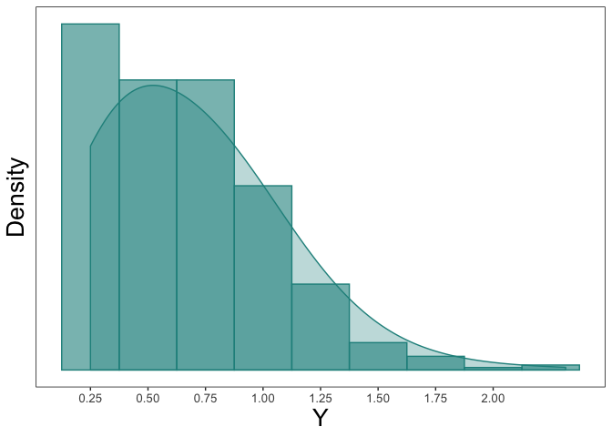

tcensReg: Maximum Likelihood Estimation of a Truncated Normal
Distribution with Censored Data
================

The goal of this package is to estimate parameters from a linear model
when the data comes from a truncated normal distribution with censoring.
Maximum likelihood values are returned derived from Newton-Raphson
algorithm using analytic values of the gradient and hessian. This
package is also able to return maximum likelihood estimates for
truncated only or censored only data similar to `truncreg` and `censReg`
packages.

# Installation

You can install ggplot.spaghetti from github via the devtools package
with:

``` r
install.packages("devtools")
devtools::install_github("williazo/tcensReg")
#to install the package with the accompaining vignette use the command below
devtools::install_github("williazo/tcensReg", build_opts=c("--no-resave-data", "--no-manual"),
                         build_vignettes=TRUE)
```

# Example 1: Single Population

Some common examples where this type of problem may arise is when there
is a natural truncation imposed by the structure of the data. For
instance several applications have an implied zero truncation such as
product lifetimes, age, or detection thresholds. To show how to
implement the functions within the package, I will demonstrate a simple
simulation example.

Assume that we have observations from an underlying truncated normal
distribution. In our case we will assume a zero-truncated model by
setting a=0. We generate this truncated normal data below and refer to
it as
`y_star`.

``` r
library(msm) #we will use this package to generate random values from the truncated normal distribution
mu <- 0.5
sigma <- 0.5
a <- 0

y_star <- msm::rtnorm(n=1000, mean=mu, sd=sigma, lower=a)
range(y_star) #note that the lowerbound will always be non-negative
```

    ## [1] 0.0009733928 2.2896172343

Next, we can imagine a scenario where we have an imprecise measurement
of `y_star` leading to censoring. In our case we assume that values
below a limit of detection, `nu`, are censored. This creates a random
variable `y`.

In the example below we set our limit of detection as `nu`=0.25.

``` r
nu <- 0.25
y <- ifelse(y_star <= nu, nu, y_star)
sum(y == nu)/length(y) #calculating the number of censored observations
```

    ## [1] 0.175

``` r
dt <- data.frame(y_star, y) #collecting the uncensored and censored data together
```

We can observe the histogram and density plot for the uncensored data,
which shows the zero-truncation.
<!-- -->

We can then compare this to the censored observations below
<!-- -->

We can then estimate the mean, `mu`, and standard deviation, `sigma`,
using `y` with the `tcensReg` package as shown below.

``` r
library(tcensReg)  #loading the package into the current environment
tcensReg(y ~ 1, data=dt, a=0, v=0.25)
```

    ## $theta
    ##               Estimate
    ## (Intercept)  0.5043155
    ## log_sigma   -0.7153226
    ## 
    ## $iterations
    ## [1] 5
    ## 
    ## $initial_ll
    ## [1] -654.8255
    ## 
    ## $final_ll
    ## [1] -641.0004
    ## 
    ## $var_cov
    ##               (Intercept)     log_sigma
    ## (Intercept)  0.0007679602 -0.0007770539
    ## log_sigma   -0.0007770539  0.0015425278

Note that the this will return parameter estimates, variance-covariance
matrix, the number of iterations until convergence, and the
initial/final log-likelihood values.

Comparing the values to the truth we see that the estimates are
unbiased.

``` r
output <- tcensReg(y ~ 1, data=dt, a=a, v=nu)
lm_output <- lm(y ~ 1, data=dt) #running OLS model for comparison
cens_output <- tcensReg(y ~ 1, data=dt, v=nu) #censored only model, i.e., Tobit model
```

    ## Warning: `a` is not specified indicating no truncation

``` r
tcensReg_est <- output$theta #extracting the point estimates
tcensReg_est[2] <- exp(tcensReg_est[2]) #exponentiating the estimate of log_sigma to estimate sigma

lm_est <- c(coef(lm_output), summary(lm_output)$sigma)

cens_est <- cens_output$theta
cens_est[2] <- exp(cens_est[2])

results_df <- data.frame(rbind(c(mu, sigma), t(tcensReg_est), lm_est, t(cens_est)))
names(results_df) <- c("mu", "sigma")
row.names(results_df) <- c("Truth", "tcensReg", "Normal MLE", "Tobit")
results_df$mu_bias <- abs(results_df$mu - mu)
results_df$sigma_bias <- abs(results_df$sigma - sigma)

knitr::kable(results_df, format="markdown", digits=4)
```

|            |     mu |  sigma | mu\_bias | sigma\_bias |
| :--------- | -----: | -----: | -------: | ----------: |
| Truth      | 0.5000 | 0.5000 |   0.0000 |      0.0000 |
| tcensReg   | 0.5043 | 0.4890 |   0.0043 |      0.0110 |
| Normal MLE | 0.6598 | 0.3651 |   0.1598 |      0.1349 |
| Tobit      | 0.6185 | 0.4265 |   0.1185 |      0.0735 |

Other methods result in significant bias for both `mu` and `sigma`.

Note also that the `tcensReg` can also estimate parameters in the
censored-only or truncated-only cases. We show below that by using
analytic values in the tcensReg implementation that our method is faster
then the alternative estimation procedures while providing better
variance estimates.

``` r
library(microbenchmark)
#testing the censored-only regression
library(censReg)
cens <- microbenchmark(tcensReg_method = tcensReg(y ~ 1, data=dt, v=nu),
               censReg_method = censReg(y ~ 1, left=nu, data=dt))
knitr::kable(summary(cens), format="markdown", digits=4)
```

| expr             |     min |      lq |    mean |  median |      uq |     max | neval |
| :--------------- | ------: | ------: | ------: | ------: | ------: | ------: | ----: |
| tcensReg\_method |  4.8422 |  5.2257 |  6.6547 |  5.4520 |  7.0055 | 20.1921 |   100 |
| censReg\_method  | 13.6909 | 15.2316 | 20.5286 | 18.9823 | 23.0765 | 71.8413 |   100 |

``` r
#point estimates are equivalent
tcensReg_est <- as.numeric(tcensReg(y ~ 1, data=dt, v=nu)$theta)
censReg_est <- as.numeric(coef(censReg(y ~ 1, left=nu, data=dt)))
all.equal(tcensReg_est, censReg_est)
```

    ## [1] TRUE

``` r
#testing the truncated-only regression
library(truncreg)
trunc <- microbenchmark(tcensReg_method = tcensReg(y_star ~ 1, data=dt, a=a),
                        truncreg_method = truncreg(y_star ~ 1, point=a, data=dt))
knitr::kable(summary(trunc), format="markdown", digits=4)
```

| expr             |     min |      lq |    mean |  median |      uq |      max | neval |
| :--------------- | ------: | ------: | ------: | ------: | ------: | -------: | ----: |
| tcensReg\_method |  8.4497 |  8.8147 | 11.6112 |  9.1379 | 11.2483 | 145.8887 |   100 |
| truncreg\_method | 26.8167 | 28.4347 | 32.8650 | 33.1872 | 34.8275 |  43.0218 |   100 |

``` r
tcensReg_est <- as.numeric(tcensReg(y_star ~ 1, data=dt, a=a)$theta)
#note truncreg returns sigma not log_sigma so we need to exponentiate our value
tcensReg_est[2] <- exp(tcensReg_est[2])
truncreg_est <- as.numeric(coef(truncreg(y_star ~ 1, point=a, data=dt)))
all.equal(tcensReg_est, truncreg_est)
```

    ## [1] TRUE
