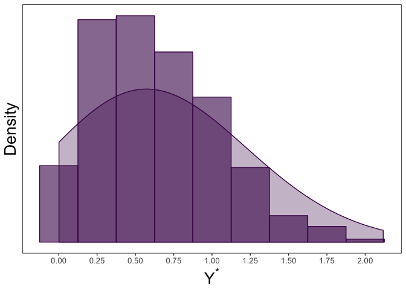

tcensReg: Maximum Likelihood Estimation of a Truncated Normal Distribution with Censored Data
================

The goal of this package is to estimate parameters from a linear model when the data comes from a truncated normal distribution with censoring. Maximum likelihood values are returned derived from Newton-Raphson algorithm using analytic values of the gradient and hessian. This package is also able to return maximum likelihood estimates for truncated only or censored only data similar to `truncreg` and `censReg` packages.

Example
-------

Some common examples where this type of problem may arise is when there is a natural truncation imposed by the structure of the data. For instance several applications have an implied zero truncation such as product lifetimes, age, or detection thresholds. To show how to implement the functions within the package, I will demonstrate a simple simulation example.

Assume that we have observations from an underlying truncated normal distribution

*Y*<sup>\*</sup> ∼ TN(*μ*, *σ*<sup>2</sup>, *ν*),

where *ν* denotes the value of the left-truncation. In our case we will assume a zero-truncated model by setting *ν* = 0.

``` r
library(msm) #we will use this package to generate random values from the truncated normal distribution
mu <- 0.8
sigma <- 0.5
nu <- 0

y_star <- msm::rtnorm(n = 100, mean = mu, sd = sigma, lower = nu)
range(y_star) #note that the lowerbound will always be non-negative
```

    ## [1] 0.03880846 2.15920614

Next, we can imagine a scenario where we have an imprecise measurement of *Y*<sup>\*</sup> leading to censoring. In our case we assume that values below *a* are censored such that *ν* &lt; *a*. This creates the random variable *Y*, where

*Y*<sub>*i*</sub> = *ν*(1<sub>{*Y*<sub>*i*</sub><sup>\*</sup> ≤ *ν*}</sub>) + *Y*<sub>*i*</sub><sup>\*</sup>(1 − 1<sub>{*Y*<sub>*i*</sub><sup>\*</sup> ≤ *ν*}</sub>) and 1<sub>{*Y*<sub>*i*</sub><sup>\*</sup> ≤ *ν*}</sub> = 1 is *Y*<sub>*i*</sub><sup>\*</sup> ≤ *ν* and 0 otherwise.

In the example below we set *a* = 0.5.

``` r
a <- 0.5
y <- ifelse(y_star<=a, a, y_star)
sum(y==a)/length(y) #calculating the number of censored observations
```

    ## [1] 0.21

``` r
dt <- data.frame(y_star, y) #collecting the uncensored and censored data together
```

We can observe the histogram and density plot for the uncensored data, which shows the zero-truncation.

    ## Loading required package: viridisLite

    ## Warning: Ignoring unknown parameters: binwidth



Note that the `echo = FALSE` parameter was added to the code chunk to prevent printing of the R code that generated the plot.

``` r
#uncomment the line below if installing the package for estimating truncated with censoring from the GitHub page for the first time
#devtools::install_github("williazo/tcensReg") 

library(tcensReg)  #loading the package into the current environment
```
