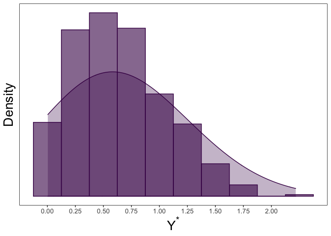

Maximum Likelihood Estimation of a Truncated Normal Distribution with
Censored Data
================

<!-- badges: start -->

[](http://www.r-pkg.org/pkg/tcensReg)
[](http://www.r-pkg.org/pkg/tcensReg)
[](https://cranchecks.info/pkgs/tcensReg)
<!-- badges: end -->

The goal of this package is to estimate parameters from a linear model
when the data comes from a truncated normal distribution with censoring.
Maximum likelihood values are returned. There are multiple method
available for optimization with the default set as conjugate gradient.
This package is also able to return maximum likelihood estimates for
truncated only or censored only data similar to `truncreg` and `censReg`
packages.

For details on the methods, simulation performance, and an application
to visual quality testing from clinical trials for intraocular lenses
see the pre-print manuscript available at
[doi:10.1186/s12874-020-01032-9](https://doi.org/10.1186/s12874-020-01032-9).

# Installation

You can install `tcensReg` from CRAN for the stable release or install
the GitHub version for the active development version:

``` r
#stable CRAN version
install.packages("tcensReg")

# or ----

#active devel. GitHub version
install.packages("devtools")
devtools::install_github("williazo/tcensReg")
```

# Example 1: Single Population

Some common examples where this type of problem may arise is when there
is a natural truncation imposed by the structure of the data. For
instance several applications have an implied zero truncation such as
product lifetimes, age, or detection thresholds. To show how to
implement the functions within the package, I will demonstrate a simple
simulation example.

Assume that we have observations from an underlying truncated normal
distribution. In our case we will assume a zero-truncated model by
setting a=0. We generate this truncated normal data below and refer to
it as `y_star`.

``` r
library(tcensReg)
mu <- 0.5
sigma <- 0.5
a <- 0

set.seed(032420)
#generate random values from the truncated normal distribution using tcensReg function
y_star <- rtnorm(n=1000, mu=mu, sd=sigma, a=a)
#note that the lowerbound will always be non-negative
round(range(y_star), 3)
```

    ## [1] 0.004 2.217

Next, we can imagine a scenario where we have an imprecise measurement
of `y_star` leading to censoring. In our case we assume that values
below a limit of detection, `nu`, are censored. This creates a random
variable `y`.

In the example below we set our limit of detection as `nu`=0.25.

``` r
nu <- 0.25
y <- ifelse(y_star <= nu, nu, y_star)
#calculating the number of censored observations
sum(y == nu)/length(y) 
```

    ## [1] 0.199

``` r
#collecting the uncensored and censored data together
dt <- data.frame(y_star, y) 
```

We can observe the histogram and density plot for the uncensored data,
which shows the zero-truncation.
<!-- -->

We can then compare this to the censored observations below
<!-- -->

We can then estimate the mean, `mu`, and standard deviation, `sigma`,
using `y` with the `tcensReg` package as shown below.

``` r
#loading the package
library(tcensReg)  
t_mod <- tcensReg(y ~ 1, data=dt, a=0, v=0.25)
summary(t_mod)
```

    ## 
    ## Call:
    ## tcensReg(formula = y ~ 1, a = 0, v = 0.25, data = dt)
    ## 
    ## Assumed Distribution:
    ## Truncated Normal with Censoring
    ## 
    ## Count of Observations:
    ##    Total Observations Censored Observations 
    ##                  1000                   199 
    ## 
    ## 
    ## Coefficients:
    ##             Estimate Std. Error t value
    ## (Intercept)   0.4562     0.0359 12.7024
    ## sigma         0.5405     0.0142 38.0508
    ## 
    ## Log Likelihood: -710.7033
    ## Information Criterion: AIC=1425.4066 BIC=1435.2221
    ## Optimization Method: CG
    ## Psuedo R2: 0 method - mckelvey_zavoina

By default the coefficients are returned along with log likelihood and
other fit criterion statistics. Note that the Pseudo R2 in the case of
an intercept only model is exactly equal to zero.

``` r
names(t_mod)
```

    ##  [1] "theta"             "convergence"       "initial_ll"       
    ##  [4] "final_ll"          "var_cov"           "method"           
    ##  [7] "info_criteria"     "model_matrix"      "call"             
    ## [10] "n_count"           "latent_assumption"

Note that the this object contains parameter estimates theta,
convergence criterion code, initial/final log-likelihood values,
variance-covariance matrix, method of optimization, information
criterion, design matrix used from the model, formula call, count of
total/censored observations, and latent distributional assumption.

Comparing the values to the truth we see that the estimates are
unbiased.

``` r
#tcensReg model
output <- tcensReg(y ~ 1, data=dt, a=a, v=nu)
#extracting the point estimates
tcensReg_est <- coef(output) #this returns sigma rather than log sigma

#OLS model
lm_output <- lm(y ~ 1, data=dt) 
lm_est <- c(coef(lm_output), summary(lm_output)$sigma)
#censored only model, i.e., Tobit model
cens_output <- tcensReg(y ~ 1, data=dt, v=nu) 
```

    ## Warning: `a` is not specified indicating no truncation

``` r
cens_est <- coef(cens_output)

results_df <- data.frame(rbind(c(mu, sigma),
                               t(tcensReg_est),
                               lm_est,
                               t(cens_est)))
names(results_df) <- c("mu", "sigma")
row.names(results_df) <- c("Truth", "tcensReg", "Normal MLE", "Tobit")
results_df$mu_bias <- results_df$mu - mu
results_df$sigma_bias <- results_df$sigma - sigma

knitr::kable(results_df, format="markdown", digits=4)
```

|            |     mu |  sigma | mu\_bias | sigma\_bias |
| :--------- | -----: | -----: | -------: | ----------: |
| Truth      | 0.5000 | 0.5000 |   0.0000 |      0.0000 |
| tcensReg   | 0.4562 | 0.5405 | \-0.0438 |      0.0405 |
| Normal MLE | 0.6685 | 0.3841 |   0.1685 |    \-0.1159 |
| Tobit      | 0.6166 | 0.4595 |   0.1166 |    \-0.0405 |

Other methods result in significant bias for both `mu` and `sigma`.

# Example 2: Two Population Model with Separate Variances

As an extension for the single population model above, we can imagine a
two independent truncated normal random variables that have common
censoring and truncation values but different standard deviations.

We can simulate the underlying truncated normal distributions `Y1_star`
and `Y2_star` similar to \(Y\) above except now we allow them to have
separate mean and variances.

For this example we let `mu_1`=0.5, `mu_2`=1, `sigma_1`=0.25,
`sigma_2`=2, and `a`=0.

``` r
mu_1 <- 0.5
mu_2 <- 1
sigma_1 <- 0.25
sigma_2 <- 2
a <- 0

set.seed(032420)
y_1_star <- rtnorm(1000, mu = mu_1, sd = sigma_1, a = a)
y_2_star <- rtnorm(1000, mu = mu_2, sd = sigma_2, a = a)
df <- data.frame(y_star = c(y_1_star, y_2_star), 
                 group = c(rep("Population 1", length(y_1_star)),
                           rep("Population 2", length(y_2_star))))
```

Plotting each of these uncensored population densities, we can see the
difference in shape based on the underlying parameter selection.

<!-- -->

Then censoring each observation at `nu`, we are left with `Y1` and `Y2`.
Again, we let `nu`=0.25.

``` r
nu <- 0.25
df$y <- ifelse(df$y_star<=nu, nu, df$y_star)
```

We then can fit our model with separate variances for each group using
the command `tcensReg_sepvar` as shown below.

``` r
mod_result <- tcensReg_sepvar(y ~ group, a=a, v=nu, group_var="group", method="maxLik", data=df)
mod_result
```

    ## $theta
    ##       (Intercept) groupPopulation 2        log_sigma1        log_sigma2 
    ##         0.4933551         0.6659116        -1.3281990         0.6546893 
    ## 
    ## $convergence
    ## [1] 2
    ## 
    ## $initial_ll
    ## [1] -2013.046
    ## 
    ## $final_ll
    ## [1] -1933.59
    ## 
    ## $var_cov
    ##                     (Intercept) groupPopulation 2    log_sigma1    log_sigma2
    ## (Intercept)        9.384525e-05     -9.384525e-05 -9.865163e-05 -1.179984e-14
    ## groupPopulation 2 -9.384525e-05      2.475291e-02  9.865163e-05 -6.214006e-03
    ## log_sigma1        -9.865163e-05      9.865163e-05  8.721167e-04  1.240418e-14
    ## log_sigma2        -1.179984e-14     -6.214006e-03  1.240418e-14  2.211993e-03
    ## 
    ## $method
    ## [1] "maxLik"

``` r
sepvar_est <- mod_result$theta
mu_1_est <- sepvar_est[1]
mu_2_est <- sum(sepvar_est[1:2])
sigma_1_est <- exp(sepvar_est[3])
sigma_2_est <- exp(sepvar_est[4])

results_df <- data.frame(rbind(c(mu_1, mu_2, sigma_1, sigma_2),
                               c(mu_1_est, mu_2_est, sigma_1_est, sigma_2_est)))
names(results_df) <- c("mu_1", "mu_2", "sigma_1", "sigma_2")
row.names(results_df) <- c("Truth", "tcensReg")
results_df$mu1_pct_bias <- paste0(round(((results_df$mu_1 - mu_1)/mu_1)*100, 2), "%")
results_df$mu2_pct_bias <- paste0(round(((results_df$mu_2 - mu_2)/mu_2)*100, 2), "%")
results_df$sigma1_pct_bias <- paste0(round(((results_df$sigma_1 - sigma_1)/sigma_1)*100, 2), "%")
results_df$sigma2_pct_bias <- paste0(round(((results_df$sigma_2 - sigma_2)/sigma_2)*100, 2), "%")

knitr::kable(results_df, format="markdown", digits=4)
```

|          |  mu\_1 |  mu\_2 | sigma\_1 | sigma\_2 | mu1\_pct\_bias | mu2\_pct\_bias | sigma1\_pct\_bias | sigma2\_pct\_bias |
| :------- | -----: | -----: | -------: | -------: | :------------- | :------------- | :---------------- | :---------------- |
| Truth    | 0.5000 | 1.0000 |    0.250 |   2.0000 | 0%             | 0%             | 0%                | 0%                |
| tcensReg | 0.4934 | 1.1593 |    0.265 |   1.9245 | \-1.33%        | 15.93%         | 5.98%             | \-3.77%           |

# Performance Comparison: Censored-Only and Truncated-Only

Note also that the `tcensReg` can also estimate parameters in the
censored-only or truncated-only cases. We show below that by using
analytic values in the tcensReg implementation that our method is faster
then the alternative estimation procedures while providing better
variance estimates. With a small set of covariates and `p<<n` we can use
the Newton-Raphson method of optimization, which is computationally fast
with few covariates.

``` r
library(microbenchmark)
#testing the censored-only regression
library(censReg)
cens <- microbenchmark(tcensReg_method = tcensReg(y ~ 1, data=dt, v=nu, method="Newton"),
               censReg_method = censReg(y ~ 1, left=nu, data=dt))
knitr::kable(summary(cens), format="markdown", digits=4)
```

| expr             |     min |      lq |    mean |  median |      uq |      max | neval | cld |
| :--------------- | ------: | ------: | ------: | ------: | ------: | -------: | ----: | :-- |
| tcensReg\_method |  4.8881 |  5.0943 |  5.9877 |  5.2487 |  5.7981 |  14.1300 |   100 | a   |
| censReg\_method  | 13.7873 | 14.5127 | 19.2472 | 18.2919 | 21.4700 | 103.8775 |   100 | b   |

``` r
#point estimates are equivalent
tcensReg_est <- as.numeric(tcensReg(y ~ 1, data=dt, v=nu, method="Newton")$theta)
censReg_est <- as.numeric(coef(censReg(y ~ 1, left=nu, data=dt)))
all.equal(tcensReg_est, censReg_est)
```

    ## [1] TRUE

``` r
#testing the truncated-only regression
library(truncreg)
trunc <- microbenchmark(
  tcensReg_method = tcensReg(y_star ~ 1, data=dt, a=a, method="Newton"),
  truncreg_method = truncreg(y_star ~ 1, point=a, data=dt))
knitr::kable(summary(trunc), format="markdown", digits=4)
```

| expr             |     min |      lq |    mean |  median |      uq |     max | neval | cld |
| :--------------- | ------: | ------: | ------: | ------: | ------: | ------: | ----: | :-- |
| tcensReg\_method |  9.4831 |  9.6810 | 11.3402 |  9.9553 | 12.1703 | 19.8827 |   100 | a   |
| truncreg\_method | 16.2908 | 16.7846 | 19.4056 | 17.5601 | 21.6932 | 35.6788 |   100 | b   |

``` r
tcensReg_est <- as.numeric(tcensReg(y_star ~ 1, data=dt, a=a, method="Newton")$theta)
#note truncreg returns sigma not log_sigma so we need to exponentiate our value
tcensReg_est[2] <- exp(tcensReg_est[2])
truncreg_est <- as.numeric(coef(truncreg(y_star ~ 1, point=a, data=dt)))
all.equal(tcensReg_est, truncreg_est)
```

    ## [1] "Mean relative difference: 0.0003643991"

In the comparisons above we are using an intercept only model, but in
general we expect that interest lies in understanding how a set of
covariates effect the mean response. So to test the sensitivity and
speed as the number of covariates approaches `n` we can generate
independent random variables `X` and fit the regression model of `Y` or
`Y_star`.

We can compare the censored-only and truncated-only performance with 100
predictors, i.e. `p`=20. To illustrate some of the other available
optimization methods we will set method to BFGS, which is a quasi-Newton
optimization method.

``` r
#number of predictors
p <- 20
X <- NULL
for(i in seq_len(p)){
    X_i <- rnorm(n = length(y))
    X <- cbind(X, X_i)
}
colnames(X) <- paste0("var_", seq_len(p))
dt <- data.frame(y, X)

#testing the censored-only regression with 100 covariates
cens <- microbenchmark(tcensReg_method = tcensReg(y ~ ., data=dt, v=nu, method="BFGS"),
               censReg_method = censReg(y ~ ., left=nu, data=dt))
knitr::kable(summary(cens), format="markdown", digits=4)
```

| expr             |      min |       lq |     mean |   median |       uq |      max | neval | cld |
| :--------------- | -------: | -------: | -------: | -------: | -------: | -------: | ----: | :-- |
| tcensReg\_method | 218.2029 | 223.9493 | 234.8069 | 226.8067 | 230.3986 | 366.2588 |   100 | a   |
| censReg\_method  | 345.9823 | 362.4582 | 386.9384 | 368.1871 | 373.6284 | 530.3745 |   100 | b   |

``` r
#point estimates are equivalent
tcensReg_est <- as.numeric(tcensReg(y ~ ., data=dt, v=nu, method="BFGS")$theta)
censReg_est <- as.numeric(coef(censReg(y ~ ., left=nu, data=dt)))
all.equal(tcensReg_est, censReg_est)
```

    ## [1] "Mean relative difference: 8.089508e-05"

``` r
#testing the truncated-only regression with 100 covariates
trunc <- microbenchmark(tcensReg_method = tcensReg(y_star ~ ., data=dt, a=a, method="BFGS"),
                        truncreg_method = truncreg(y_star ~ ., point=a, data=dt))
knitr::kable(summary(trunc), format="markdown", digits=4)
```

| expr             |      min |       lq |     mean |   median |       uq |      max | neval | cld |
| :--------------- | -------: | -------: | -------: | -------: | -------: | -------: | ----: | :-- |
| tcensReg\_method | 202.3384 | 207.2465 | 215.1095 | 210.5763 | 213.9136 | 363.9193 |   100 | a   |
| truncreg\_method | 461.7276 | 470.2840 | 490.9210 | 475.7646 | 480.7120 | 637.6223 |   100 | b   |

``` r
tcensReg_est <- as.numeric(tcensReg(y_star ~ ., data=dt, a=a, method="BFGS")$theta)
#note truncreg returns sigma not log_sigma so we need to exponentiate the last parameter value
tcensReg_est[length(tcensReg_est)] <- exp(tcensReg_est[length(tcensReg_est)])
truncreg_est <- as.numeric(coef(truncreg(y_star ~ ., point=a, data=dt)))
all.equal(tcensReg_est, truncreg_est)
```

    ## [1] "Mean relative difference: 2.993568e-05"
