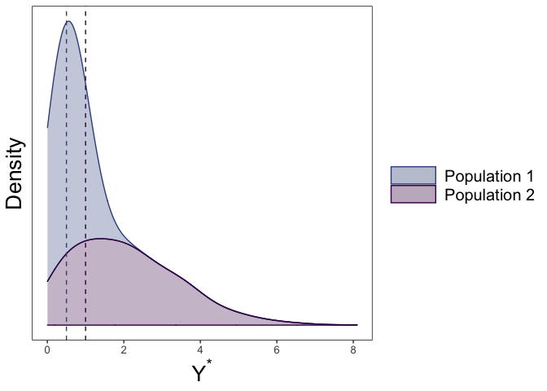

Maximum Likelihood Estimation of a Truncated Normal Distribution with
Censored Data
================

The goal of this package is to estimate parameters from a linear model
when the data comes from a truncated normal distribution with censoring.
Maximum likelihood values are returned. There are multiple method
available for optimization with the default set as conjugate gradient.
This package is also able to return maximum likelihood estimates for
truncated only or censored only data similar to `truncreg` and `censReg`
packages.

For details on the methods, simulation performance, and an application
to visual quality testing from clinical trials for intraocular lenses
see the pre-print manuscript available at
arXiv:[1911.11221](https://arxiv.org/abs/1911.11221).

# Installation

You can install `tcensReg` from CRAN:

``` r
install.packages("tcensReg")
```

# Example 1: Single Population

Some common examples where this type of problem may arise is when there
is a natural truncation imposed by the structure of the data. For
instance several applications have an implied zero truncation such as
product lifetimes, age, or detection thresholds. To show how to
implement the functions within the package, I will demonstrate a simple
simulation example.

Assume that we have observations from an underlying truncated normal
distribution. In our case we will assume a zero-truncated model by
setting a=0. We generate this truncated normal data below and refer to
it as `y_star`.

``` r
mu <- 0.5
sigma <- 0.5
a <- 0
#generate random values from the truncated normal distribution using tcensReg function
y_star <- rtnorm(n=1000, mu=mu, sd=sigma, a=a)
#note that the lowerbound will always be non-negative
round(range(y_star), 3)
```

    ## [1] 0.004 1.993

Next, we can imagine a scenario where we have an imprecise measurement
of `y_star` leading to censoring. In our case we assume that values
below a limit of detection, `nu`, are censored. This creates a random
variable `y`.

In the example below we set our limit of detection as `nu`=0.25.

``` r
nu <- 0.25
y <- ifelse(y_star <= nu, nu, y_star)
#calculating the number of censored observations
sum(y == nu)/length(y) 
```

    ## [1] 0.194

``` r
#collecting the uncensored and censored data together
dt <- data.frame(y_star, y) 
```

We can observe the histogram and density plot for the uncensored data,
which shows the zero-truncation.
<!-- -->

We can then compare this to the censored observations below
<!-- -->

We can then estimate the mean, `mu`, and standard deviation, `sigma`,
using `y` with the `tcensReg` package as shown below.

``` r
#loading the package
library(tcensReg)  
tcensReg(y ~ 1, data=dt, a=0, v=0.25)
```

    ## $theta
    ##               Estimate
    ## (Intercept)  0.4778344
    ## log_sigma   -0.6738206
    ## 
    ## $convergence
    ## [1] 0
    ## 
    ## $initial_ll
    ## [1] -692.9344
    ## 
    ## $final_ll
    ## [1] -677.5428
    ## 
    ## $var_cov
    ##               (Intercept)     log_sigma
    ## (Intercept)  0.0009767877 -0.0009602282
    ## log_sigma   -0.0009602282  0.0016796832
    ## 
    ## $method
    ## [1] "CG"

Note that the this will return parameter estimates, variance-covariance
matrix, the number of iterations until convergence, and the
initial/final log-likelihood values.

Comparing the values to the truth we see that the estimates are
unbiased.

``` r
#tcensReg model
output <- tcensReg(y ~ 1, data=dt, a=a, v=nu)
#extracting the point estimates
tcensReg_est <- output$theta 
#exponentiating the estimate of log_sigma to obtain sigma
tcensReg_est[2] <- exp(tcensReg_est[2]) 

#OLS model
lm_output <- lm(y ~ 1, data=dt) 
lm_est <- c(coef(lm_output), summary(lm_output)$sigma)
#censored only model, i.e., Tobit model
cens_output <- tcensReg(y ~ 1, data=dt, v=nu) 
```

    ## Warning: `a` is not specified indicating no truncation

``` r
cens_est <- cens_output$theta
cens_est[2] <- exp(cens_est[2])


results_df <- data.frame(rbind(c(mu, sigma),
                               t(tcensReg_est),
                               lm_est,
                               t(cens_est)))
names(results_df) <- c("mu", "sigma")
row.names(results_df) <- c("Truth", "tcensReg", "Normal MLE", "Tobit")
results_df$mu_bias <- abs(results_df$mu - mu)
results_df$sigma_bias <- abs(results_df$sigma - sigma)

knitr::kable(results_df, format="markdown", digits=4)
```

|            |     mu |  sigma | mu\_bias | sigma\_bias |
| :--------- | -----: | -----: | -------: | ----------: |
| Truth      | 0.5000 | 0.5000 |   0.0000 |      0.0000 |
| tcensReg   | 0.4778 | 0.5098 |   0.0222 |      0.0098 |
| Normal MLE | 0.6594 | 0.3702 |   0.1594 |      0.1298 |
| Tobit      | 0.6113 | 0.4408 |   0.1113 |      0.0592 |

Other methods result in significant bias for both `mu` and `sigma`.

# Example 2: Two Population Model with Separate Variances

As an extension for the single population model above, we can imagine a
two independent truncated normal random variables that have common
censoring and truncation values but different standard deviations.

We can simulate the underlying truncated normal distributions `Y1_star`
and `Y2_star` similar to \(Y\) above except now we allow them to have
separate mean and variances.

For this example we let `mu_1`=0.5, `mu_2`=1, `sigma_1`=0.25,
`sigma_2`=2, and `a`=0.

``` r
mu_1 <- 0.5
mu_2 <- 1
sigma_1 <- 0.25
sigma_2 <- 2
a <- 0

y_1_star <- rtnorm(1000, mu = mu_1, sd = sigma_1, a = a)
y_2_star <- rtnorm(1000, mu = mu_2, sd = sigma_2, a = a)
df <- data.frame(y_star = c(y_1_star, y_2_star), 
                 group = c(rep("Population 1", length(y_1_star)),
                           rep("Population 2", length(y_2_star))))
```

Plotting each of these uncensored population densities, we can see the
difference in shape based on the underlying parameter selection.

<!-- -->

Then censoring each observation at `nu`, we are left with `Y1` and `Y2`.
Again, we let `nu`=0.25.

``` r
nu <- 0.25
df$y <- ifelse(df$y_star<=nu, nu, df$y_star)
```

We then can fit our model with separate variances for each group using
the command `tcensReg_sepvar` as shown below.

``` r
mod_result <- tcensReg_sepvar(y ~ group, a=a, v=nu, group_var="group", method="maxLik", data=df)
mod_result
```

    ## $theta
    ##       (Intercept) groupPopulation 2        log_sigma1        log_sigma2 
    ##         0.4875891         0.6475935        -1.4094346         0.6907025 
    ## 
    ## $convergence
    ## [1] 2
    ## 
    ## $initial_ll
    ## [1] -1941.744
    ## 
    ## $final_ll
    ## [1] -1864.28
    ## 
    ## $var_cov
    ##                     (Intercept) groupPopulation 2    log_sigma1
    ## (Intercept)        7.455164e-05     -7.455164e-05 -7.176795e-05
    ## groupPopulation 2 -7.455164e-05      2.833121e-02  7.176795e-05
    ## log_sigma1        -7.176795e-05      7.176795e-05  8.143326e-04
    ## log_sigma2        -4.901979e-15     -6.821170e-03  4.718944e-15
    ##                      log_sigma2
    ## (Intercept)       -4.901979e-15
    ## groupPopulation 2 -6.821170e-03
    ## log_sigma1         4.718944e-15
    ## log_sigma2         2.283660e-03
    ## 
    ## $method
    ## [1] "maxLik"

``` r
sepvar_est <- mod_result$theta
sepvar_est[3:4] <- exp(sepvar_est[3:4])

results_df <- data.frame(rbind(c(mu_1, mu_2, sigma_1, sigma_2),
                               t(sepvar_est)))
names(results_df) <- c("mu_1", "mu_2", "sigma_1", "sigma_2")
row.names(results_df) <- c("Truth", "tcensReg")
results_df$mu1_bias <- abs(results_df$mu_1 - mu_1)
results_df$mu2_bias <- abs(results_df$mu_2 - mu_2)
results_df$sigma1_bias <- abs(results_df$sigma_1 - sigma_1)
results_df$sigma2_bias <- abs(results_df$sigma_2 - sigma_2)

knitr::kable(results_df, format="markdown", digits=4)
```

|          |  mu\_1 |  mu\_2 | sigma\_1 | sigma\_2 | mu1\_bias | mu2\_bias | sigma1\_bias | sigma2\_bias |
| :------- | -----: | -----: | -------: | -------: | --------: | --------: | -----------: | -----------: |
| Truth    | 0.5000 | 1.0000 |   0.2500 |   2.0000 |    0.0000 |    0.0000 |       0.0000 |       0.0000 |
| tcensReg | 0.4876 | 0.6476 |   0.2443 |   1.9951 |    0.0124 |    0.3524 |       0.0057 |       0.0049 |

# Performance Comparison: Censored-Only and Truncated-Only

Note also that the `tcensReg` can also estimate parameters in the
censored-only or truncated-only cases. We show below that by using
analytic values in the tcensReg implementation that our method is faster
then the alternative estimation procedures while providing better
variance estimates. With a small set of covariates and `p<<n` we can use
the Newton Raphson method of optimization, which is computationally fast
with few covariates.

``` r
library(microbenchmark)
#testing the censored-only regression
library(censReg)
cens <- microbenchmark(tcensReg_method = tcensReg(y ~ 1, data=dt, v=nu, method="Newton"),
               censReg_method = censReg(y ~ 1, left=nu, data=dt))
knitr::kable(summary(cens), format="markdown", digits=4)
```

| expr             |     min |      lq |    mean |  median |      uq |     max | neval | cld |
| :--------------- | ------: | ------: | ------: | ------: | ------: | ------: | ----: | :-- |
| tcensReg\_method |  4.8988 |  5.0706 |  6.2779 |  5.2245 |  6.1985 | 13.5982 |   100 | a   |
| censReg\_method  | 13.7588 | 14.3828 | 20.1981 | 19.3609 | 22.1070 | 94.7555 |   100 | b   |

``` r
#point estimates are equivalent
tcensReg_est <- as.numeric(tcensReg(y ~ 1, data=dt, v=nu, method="Newton")$theta)
censReg_est <- as.numeric(coef(censReg(y ~ 1, left=nu, data=dt)))
all.equal(tcensReg_est, censReg_est)
```

    ## [1] TRUE

``` r
#testing the truncated-only regression
library(truncreg)
trunc <- microbenchmark(
  tcensReg_method = tcensReg(y_star ~ 1, data=dt, a=a, method="Newton"),
  truncreg_method = truncreg(y_star ~ 1, point=a, data=dt))
knitr::kable(summary(trunc), format="markdown", digits=4)
```

| expr             |     min |      lq |    mean |  median |      uq |     max | neval | cld |
| :--------------- | ------: | ------: | ------: | ------: | ------: | ------: | ----: | :-- |
| tcensReg\_method |  8.3232 |  8.6242 | 10.2803 |  9.0937 | 10.9995 | 21.4538 |   100 | a   |
| truncreg\_method | 26.8182 | 28.7343 | 32.5956 | 32.6787 | 34.2838 | 42.0412 |   100 | b   |

``` r
tcensReg_est <- as.numeric(tcensReg(y_star ~ 1, data=dt, a=a, method="Newton")$theta)
#note truncreg returns sigma not log_sigma so we need to exponentiate our value
tcensReg_est[2] <- exp(tcensReg_est[2])
truncreg_est <- as.numeric(coef(truncreg(y_star ~ 1, point=a, data=dt)))
all.equal(tcensReg_est, truncreg_est)
```

    ## [1] "Mean relative difference: 6.765638e-08"

In the comparisons above we are using an intercept only model, but in
general we expect that interest lies in understanding how a set of
covariates effect the mean response. So to test the sensitivity and
speed as the number of covariates approaches `n` we can generate
independent random variables `X` and fit the regression model of `Y` or
`Y_star`.

We can compare the censored-only and truncated-only performance with 100
predictors, i.e. `p`=20. To illustrate some of the other available
optimization methods we will set method to BFGS, which is a quasi-Newton
optimization method.

``` r
#number of predictors
p <- 20
X <- NULL
for(i in seq_len(p)){
    X_i <- rnorm(n = length(y))
    X <- cbind(X, X_i)
}
colnames(X) <- paste0("var_", seq_len(p))
dt <- data.frame(y, X)

#testing the censored-only regression with 100 covariates
cens <- microbenchmark(tcensReg_method = tcensReg(y ~ ., data=dt, v=nu, method="BFGS"),
               censReg_method = censReg(y ~ ., left=nu, data=dt))
knitr::kable(summary(cens), format="markdown", digits=4)
```

| expr             |      min |       lq |     mean |   median |       uq |      max | neval | cld |
| :--------------- | -------: | -------: | -------: | -------: | -------: | -------: | ----: | :-- |
| tcensReg\_method | 239.6229 | 252.3713 | 282.4082 | 266.8667 | 287.2247 | 463.9361 |   100 | a   |
| censReg\_method  | 322.4404 | 352.1741 | 399.5644 | 370.3153 | 419.7930 | 735.0033 |   100 | b   |

``` r
#point estimates are equivalent
tcensReg_est <- as.numeric(tcensReg(y ~ ., data=dt, v=nu, method="BFGS")$theta)
censReg_est <- as.numeric(coef(censReg(y ~ ., left=nu, data=dt)))
all.equal(tcensReg_est, censReg_est)
```

    ## [1] "Mean relative difference: 5.836655e-05"

``` r
#testing the truncated-only regression with 100 covariates
trunc <- microbenchmark(tcensReg_method = tcensReg(y_star ~ ., data=dt, a=a, method="BFGS"),
                        truncreg_method = truncreg(y_star ~ ., point=a, data=dt))
knitr::kable(summary(trunc), format="markdown", digits=4)
```

| expr             |      min |       lq |     mean |   median |       uq |      max | neval | cld |
| :--------------- | -------: | -------: | -------: | -------: | -------: | -------: | ----: | :-- |
| tcensReg\_method | 287.1785 | 297.9352 | 316.3781 | 305.2113 | 325.1183 | 650.2492 |   100 | a   |
| truncreg\_method | 315.6116 | 324.9087 | 352.0834 | 334.6383 | 359.1795 | 659.4248 |   100 | b   |

``` r
tcensReg_est <- as.numeric(tcensReg(y_star ~ ., data=dt, a=a, method="BFGS")$theta)
#note truncreg returns sigma not log_sigma so we need to exponentiate the last parameter value
tcensReg_est[length(tcensReg_est)] <- exp(tcensReg_est[length(tcensReg_est)])
truncreg_est <- as.numeric(coef(truncreg(y_star ~ ., point=a, data=dt)))
all.equal(tcensReg_est, truncreg_est)
```

    ## [1] "Mean relative difference: 8.163993e-05"
